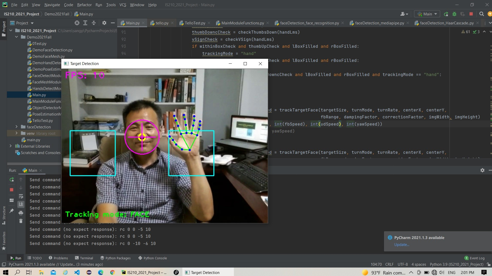

<h4>ver:  Janurary-2023</h4>

<h2>[Python] DJI Tello Programming</h2>

 <h3>1. Programming Environment</h3>

-   <u>Python Interpreter Version: 3.9.10</u> <em>(Python 3.10.x and above versions are not compatible with Tello Library)</em>
-   Python Libraries

    -   djitellopy (numpy)
    -   opencv-python
    -   MediaPipe (pillow, absi-py, attrs, etc.)
    -   pygame (# keyboard control)

-   Refer to [djitellopy API](https://djitellopy.readthedocs.io/en/latest/) page  

<h3>2. Single Drone Control Example</h3>

-   Laptop connects to drone access point

1. Basic Movement Test : [BasicTest01.py](../IS210%24DroneProgramming/BasicTest01.py)
2. Keyboard Control Test & Video : [TelloControlByKeys.py](../IS210%24DroneProgramming/TelloControlByKeys.py)
3. MediaPipe Application
    - Face tracking mode
    - Hand gesture control mode

<h3>3. Swarm Control Example: Tello EDU</h3>

-   Drones connect to a router or an access point drone access point

<!-- 1. Basic Movement Test : [basicTest.py](link-to-file)
2. Keyboard Control Test & Video : [keyControl.py](link-to-file)
3. MediaPipe Application
   -   Face tracking mode
   -   Hand gesture control mode -->
